# AIPhobia

**Developer:** Enrique Hernández Noguera
**Course:** AI in Gaming — Second Semester
**Engine:** Unity (URP, NavMesh, New Input System, Cinemachine, TextMesh Pro)

<p align="center">
  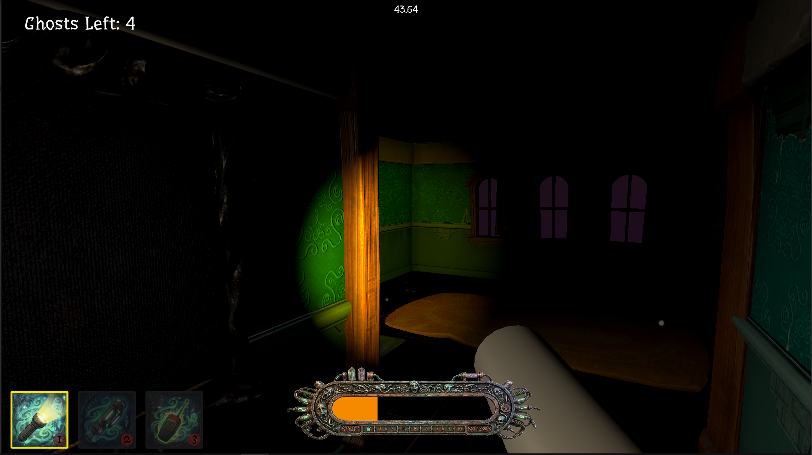
  <br>
  <i>The mansion at night — the player's lantern is the only meaningful light source, and the darkness hides everything (and everyone) else.</i>
</p>

---

## What Is AIPhobia?

AIPhobia is a first-person ghost-hunting game built in Unity, taking direct inspiration from *Phasmophobia* and reinterpreting it through a more colorful, action-oriented lens. Rather than the slow burn of investigation, AIPhobia drops the player directly into a haunted house for a tense one-on-one showdown: you have a vacuum and a lantern, the ghost has seven behavioral states and an ectoplasm cannon, and only one of you is walking out.

The art style deliberately echoes classic *Ghostbusters* — low-poly geometry, vivid ambient lighting, and cartoonish projectiles — keeping the tone spooky but not distressing. The environment reuses the layout from Unity's "John Lemon's Haunted Jaunt" tutorial, which freed development time to focus on what the class cares about: AI systems, physics mechanics, and game feel.

The ghost is driven entirely by a handwritten Finite State Machine. It patrols when idle, investigates sounds when the player makes noise, gives chase on line-of-sight, hurls glowing ectoplasm when close enough, and phases through walls to flee when threatened. The player's only weapon is the vacuum — but the ghost fights back.

<p align="center">
  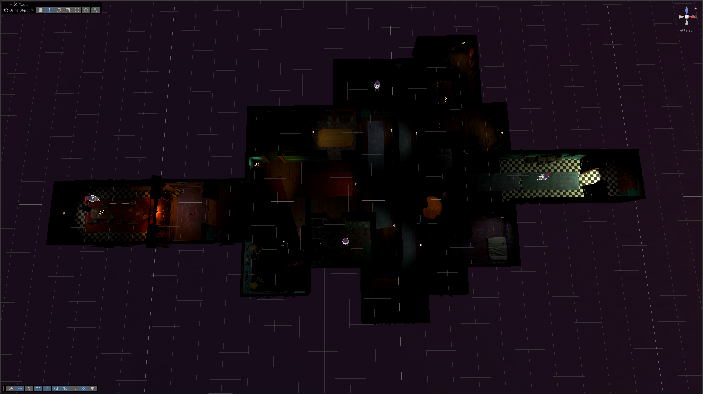
  <br>
  <i>Top-down overview of the haunted mansion — multiple rooms, corridors, and locked doors connecting them.</i>
</p>

---

## Objectives

### How to Win
Vacuum the ghost down to zero HP. Every Vacuumable object with health registers itself with `GhostManager` on startup. When its HP hits zero, `Vacuumable.Die()` calls `GhostManager.RemoveGhost()`. Once all ghosts are gone, `GhostManager` fires `GameEnding.WinGame()` and the win screen fades in.

### How to Lose
Let your Scared Bar fill up completely. The bar has a maximum of **1300 fear units**. It fills passively over time, accelerates while the ghost is visible, and spikes instantly when an ectoplasm projectile hits you. When the bar reaches max, `ScaredMeter` calls `GameEnding.CaughtPlayer()` and the lose screen takes over.

---

## Controls

| Input | Action |
|-------|--------|
| `W A S D` | Move |
| Mouse | Look around |
| `Left Click` | Use equipped tool (vacuum fire / lantern toggle) |
| `1` | Equip Vacuum |
| `2` | Equip Lantern |
| `3` | Equip third tool slot |
| `Mouse Wheel` | Cycle through tools |
| Press active tool key again | Deselect tool (empty hands) |
| `E` | Interact (pick up keys, open doors) |

<p align="center">
  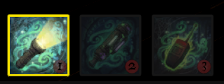
  <br>
  <i>The hotbar HUD — three tool slots, the active one tinted brighter so the player always knows what they are holding.</i>
</p>

---

## Features

### Ghost AI — 7-State Finite State Machine

The ghost brain (`GhostAI.cs`) is a handwritten FSM with seven distinct behavioral states. Each state has its own update loop, its own transition conditions, and in some cases its own NavMesh speed and movement mode.

<p align="center">
  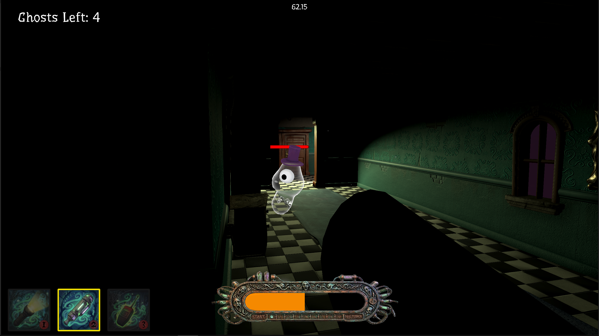
  <br>
  <i>Face-to-face encounter — once the ghost crosses the player's vision cone the FSM jumps from Wander straight into Chase.</i>
</p>

**States and Transitions:**

| State | Behavior | Exits To |
|-------|----------|----------|
| **Wander** | Picks random NavMesh points and patrols | Chase (sees player), Investigate (hears player), Flee (being vacuumed), Hide (low health) |
| **Investigate** | Moves to last known player position, times out | Chase (sees player), Wander (timeout), Flee, Hide |
| **Chase** | Sprints directly toward player via NavMesh | Spook (in range + cooldown), Flee (vacuumed), Hide (low health), Investigate (LOS lost but nearby), Wander (LOS lost, far) |
| **Spook** | Stops, winds up, throws ectoplasm | Flee (after throw + 0.3s delay) |
| **Flee** | Disables NavMeshAgent, phases through walls | Chase or Wander (once far enough from player) |
| **Hide** | Navigates to a distant NavMesh corner | Hidden (on arrival) |
| **Hidden** | Slow wanders in hiding area | Hide (player gets close again) |

**Vision System (`CanSeePlayer`):**
Vision is checked with a two-part test: first a field-of-view cone (default **110° full width**, **15f range**), then a layer-agnostic raycast. The raycast casts toward the player and hits the very first solid collider in the way. If that first hit is the player, LOS is confirmed; if anything else (wall, door, furniture) is in between, the ghost is blocked. This design avoids layer dependency bugs where door prefabs on the wrong layer would pass the raycast silently.

**Hearing System (`IsPlayerNearby`):**
The ghost hears the player only when the player is actively moving (via the `PlayerNoise.isEmittingNoise` flag). A stationary player is completely silent. In open air the hearing radius is **8f**. If a solid object is between the ghost and player (detected via a secondary raycast), the effective radius drops to **4f** — the ghost hears muffled sounds through walls but at much shorter range.

**Flee Mechanics:**
When the ghost enters FLEE, its `NavMeshAgent` is disabled entirely and it moves via `Vector3.MoveTowards` directly on the Transform — this is what lets it pass through walls. `UpdateFlee()` picks a flee target in the opposite direction from the player, moves toward it, and chains new flee legs if it reaches the target before escaping. When the ghost is finally far enough from the player, it calls `NavMesh.SamplePosition` to find the nearest legal NavMesh point, snaps `transform.position` to it (before re-enabling the agent, since enabling inside geometry causes agent creation errors), then calls `agent.Warp()` to sync the agent's internal state. Flee rotation is handled with `Quaternion.RotateTowards` at a fixed deg/sec rate so the ghost always faces the direction it's sliding — no more sideways hockey-puck movement.

**Hide Mechanics:**
At low health (below 25% by default), the ghost navigates to a distant corner of the map (`hideBiasRange` pushes the target selection far away). On arrival it enters HIDDEN and slow-wanders. Its hearing radius expands to **14f** in this state so it can react to players who found it.

**Vacuum Latch:**
`isBeingVacuumed` is a computed property rather than a flag: it returns true if `(Time.time - lastVacuumedTime) < vacuumLatchTime` (default **0.2s**). This means the ghost reacts to being vacuumed for a fraction of a second after the vacuum leaves it, preventing one-frame flicker between states.

<p align="center">
  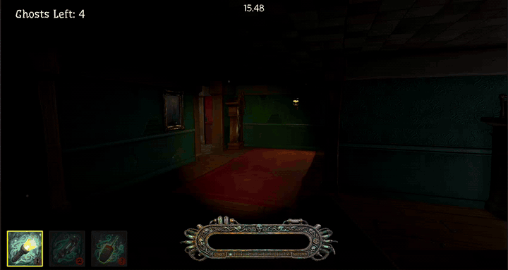
  <br>
  <i>The FSM in action — ghosts approach, throw ectoplasm during Spook, then enter Flee and phase straight through walls to escape.</i>
</p>

---

### Scared Bar — Fear Meter

The player's fear level is tracked by `ScaredMeter.cs`, a MonoBehaviour on the Player GameObject that drives both the game-over condition and the fill of the Scared Bar UI.

**Fill Sources:**

| Source | Rate / Amount |
|--------|---------------|
| Passive fill | 4 fear/second — always running |
| Ghost is visible | +8 fear/second (stacked on passive) |
| Ectoplasm projectile hit | +150 fear (instant) |
| Ghost kill reward | −`killFearReduction` (one-shot on ghost death, default tuned in Inspector) |

**`CanPlayerSeeGhost()`** is called every frame to determine whether the visibility bonus applies. It performs a two-part check: the ghost must be within the player camera's forward FOV cone AND an unobstructed raycast from the camera to the ghost must succeed (using the Walls layer mask). If either fails, the visibility bonus is not applied.

**Game Over:** When `currentFear >= maxFear` (1300), `ScaredMeter` sets a `gameover` flag to prevent double-triggers and calls `gameEnding.CaughtPlayer()`.

**Scared Bar UI:**
The bar uses a two-layer Canvas pattern. `ScaredBar_BG` is a static decorative image (custom art, transparent background). `ScaredBar_Fill` sits on top with `Image Type: Filled, Fill Method: Horizontal, Origin: Left`. `ScaredMeter.UpdateBar()` sets `fillAmount = currentFear / maxFear` every frame. The fill color visually communicates danger level.

<p align="center">
  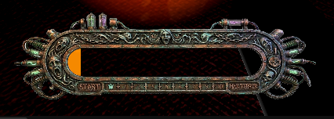
  <br>
  <i>The two-layer fear meter — a static decorative frame with an orange <code>Image Type: Filled</code> layer driven by <code>fillAmount = currentFear / maxFear</code> every frame.</i>
</p>

---

### Ectoplasm Projectile

When the ghost enters its Spook state and the windup timer expires, `GhostAI.ThrowEctoplasm()` instantiates the `EctoplasmProjectile` prefab at the `ThrowOrigin` child Transform and calls `projectile.Launch(playerPosition)`.

**Parabolic Arc:**
The projectile computes its trajectory in `Update()` using a parametric approach. Time `t` is normalized from 0 to 1 over `flightDuration` (1.5s). The horizontal position is a simple linear lerp between `startPosition` and `targetPosition`. The vertical offset is `Sin(t * PI) * arcHeight` — this gives zero height at launch, a peak at the midpoint, and zero again at landing, creating a smooth natural arc without any physics engine involvement. `arcHeight` defaults to **2.5f**.

**Collision:**
`OnTriggerEnter` fires when the projectile's SphereCollider (Is Trigger = true) overlaps something. If the other collider is tagged `"Player"`, `targetMeter.AddFear(ectoplasmHit)` is called and the projectile destroys itself. If the collider is a solid non-trigger, the projectile is destroyed without effect.

**Prefab:**
The projectile is a green emissive sphere (URP Lit material with emission enabled). The `targetMeter` reference is assigned at runtime by GhostAI when the projectile is instantiated — the Inspector field is left blank in the prefab.

<p align="center">
  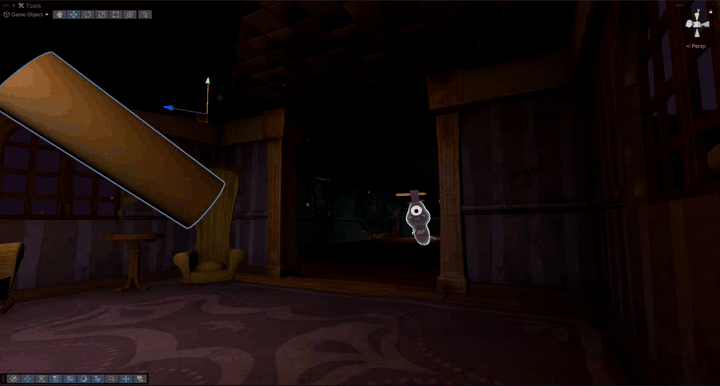
  <br>
  <i>Side-angle view of the parabolic ectoplasm arc — the projectile launches from <code>ThrowOrigin</code> and rises and falls along a <code>Sin(t * PI)</code> curve. The cylinder the ghost is aiming at is the player: AIPhobia is first-person and has no body mesh, so from the outside the player reads as just the floating tool model they are holding.</i>
</p>

---

### Vacuum Tool

The vacuum (`VacuumTool.cs`) is the player's only weapon and the central mechanical loop of the game. Left-click fires a continuous beam; releasing stops it.

<p align="center">
  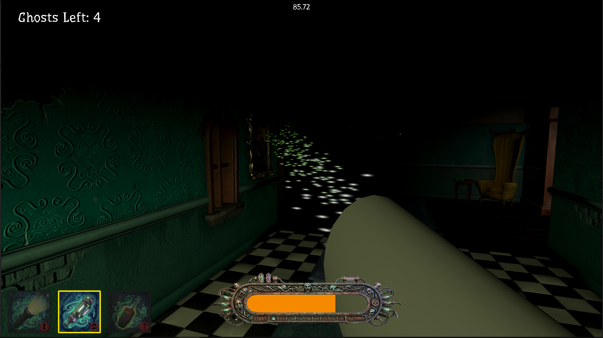
  <br>
  <i>The vacuum firing in first person — procedural shake, motor audio ramp, and a particle suction cone all driven by the same <code>currentShakeWeight</code> value.</i>
</p>

<p align="center">
  
  <br>
  <i>Vacuum interacting with physics-enabled props — <code>Vacuumable.GetVacuumed()</code> calls <code>Rigidbody.AddForce</code> for objects with mass, dragging them across the floor.</i>
</p>

**Targeting:**
Each frame while active, a raycast fires from the camera center forward up to `suctionRange` (10f). If the ray hits a collider with a `Vacuumable` component, `GetVacuumed(vacuumModel.position, suctionPower, distanceMult)` is called. The distance multiplier is normalized: 1.0 at point-blank, decreasing toward zero at max range, so the vacuum is strongest when you are close.

**Procedural Shake Animation:**
The vacuum model does not use keyframed animation. Instead, `currentShakeWeight` ramps up from 0 to 1 over time using `Mathf.MoveTowards` at `motorRampSpeed` while firing, and ramps back to 0 when released. Each frame, the model's local position is offset by `Random.insideUnitSphere * maxShakeIntensity * currentShakeWeight` — rapid random vectors that create a convincing mechanical rumble that scales with activation level.

**Audio:**
The vacuum motor (`vacuum_motor.wav`) loops on an AudioSource. Its `pitch` and `volume` are both driven by `currentShakeWeight`, so the motor spins up audibly as you hold the trigger and winds down smoothly when you release. This is the same "spin-up/spin-down" ramp used for the visual shake.

**Particle VFX:**
A Particle System child of the vacuum model plays automatically when the vacuum is activated and stops when released, producing a visible suction cone effect in front of the nozzle.

---

### Vacuumable Physics System

`Vacuumable.cs` is a universal component that turns any GameObject into something the vacuum can interact with. Attach it to furniture, props, or the ghost.

**Two Pull Modes:**
- **Rigidbody objects (furniture):** `GetVacuumed()` calls `rb.AddForce(direction * basePower * distanceMultiplier * 20f)`. Unity's physics engine then handles mass, linear damping, and gravity — objects slide and drag across the floor realistically.
- **Non-Rigidbody objects (ghost):** `Vector3.MoveTowards` translates the Transform directly toward the vacuum at `(basePower / weight) * distanceMult`, bypassing the physics engine for predictable enemy movement.

**Health and Damage:**
When `hasHealth = true` (set on the ghost), the object takes damage every frame it is being vacuumed. A world-space health bar Image scales its width in proportion to remaining HP via `updateHealthBarUI()`.

**Death:**
When `health <= 0`, `Die()` runs:
1. Finds the player's `ScaredMeter` via `Object.FindAnyObjectByType` and calls `ReduceFear(killFearReduction)` — a fear reward for the kill.
2. Calls `GhostManager.Instance.RemoveGhost()` — decrements the ghost counter and potentially triggers the win condition.
3. Calls `Destroy(gameObject)`.

**Editor Utility (`VacuumableSetup.cs`):**
A custom menu under `AIPhobia/` in the Unity Editor lets you batch-convert any selected GameObjects (or their backing prefab assets) into vacuumable props. It adds `BoxCollider`, `Rigidbody` (with tuned mass/damping/interpolation/CCD settings), and `Vacuumable` in one click. A reverse option removes them and restores Static flags.

---

### Lantern Tool

`LanternTool.cs` manages a toggleable spotlight carried by the player.

<p align="center">
  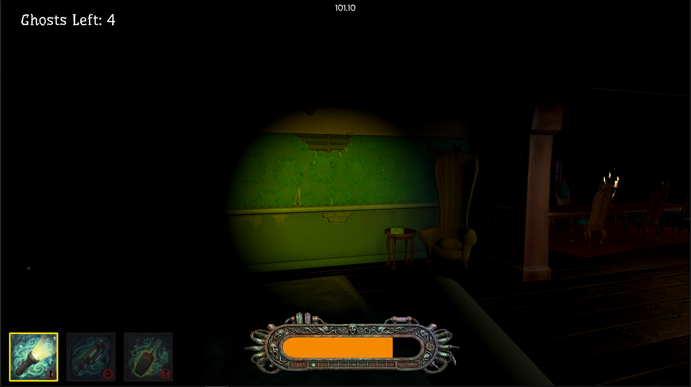
  <br>
  <i>The lantern lighting a dim corridor — the toggleable spotlight is the player's only reliable way of seeing more than a few meters ahead.</i>
</p>

Left-clicking while the lantern is equipped toggles the spotlight on or off. Each toggle plays a distinct `PlayOneShot` audio clip — `flashlight_click_on.mp3` or `flashlight_click_off.mp3` — without interrupting any ambient audio loops.

Because the entire Lantern GameObject is enabled/disabled by the `ToolChanger` when switching tools, the spotlight child naturally inherits its parent's disabled state when the tool is put away. When the lantern is re-equipped, it restores whichever on/off state it was in — the light remembers where it left off without any extra state management.

The lantern model (along with the vacuum model) is assigned to a custom **Weapon layer** so it can be rendered by the dedicated Weapon Camera with a very close near clip plane. This prevents the cylindrical clipping artifact that occurs when first-person tool models get too close to a camera with a standard near plane.

---

### Tool Management System

`ToolChanger.cs` (in `Assets/Package/`) is the active tool manager. It controls which tool is active at any moment and keeps the 3D GameObjects in sync with the 2D hotbar HUD.

**Input:**
- **Mouse Wheel:** Cycles through the tool array with wraparound.
- **Keys 1/2/3:** Jump directly to a tool slot.
- **Same key twice:** Deactivates the current tool (index -1, empty hands).

**Sync:**
`ToolChanger` holds three parallel arrays: `toolObjects[]` (3D GameObjects to enable/disable), `toolFrames[]` (UI Image borders), and `toolIcons[]` (UI Graphics). On each switch, `SwitchTool(index)` enables the matching 3D GameObject, disables the rest, and calls `UpdateUI()` to tint the selected frame and icon bright while dimming all others. This gives immediate visual feedback about which tool is held.

`ToolSwitcher.cs` is an earlier, simpler version of the same idea — it handles 3D switching but has no UI sync. It remains in the project as reference.

---

### Key & Door Interaction System

The interaction system is built around a small interface pattern that makes any object in the scene interactable with a single E keypress.

<p align="center">
  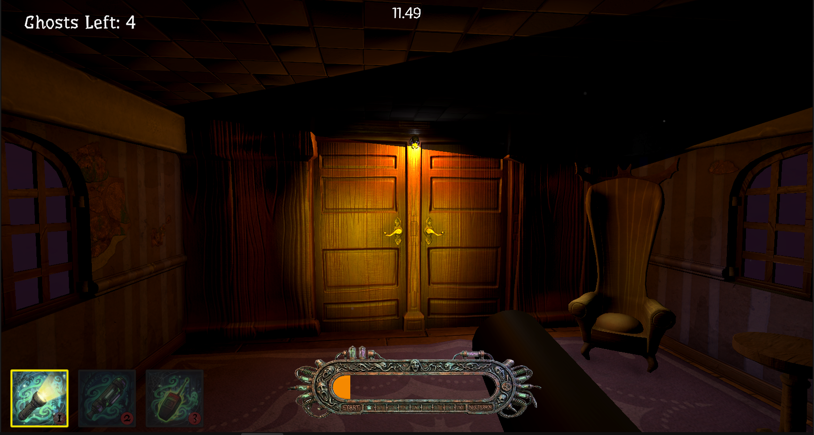
  <br>
  <i>The final locked door — <code>InteractableDoor</code> checks <code>PlayerKeys.OwnKey(requiredKey)</code> and only accepts the player's E-press if they are carrying the matching key.</i>
</p>

<p align="center">
  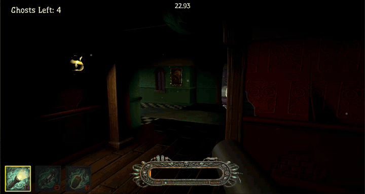
  <br>
  <i>Tracking down and picking up the final key — the trigger volume on the key calls <code>PlayerKeys.AddKey()</code> via <code>GetComponentInParent</code>, then destroys itself.</i>
</p>

**`IInteractable` Interface:**
```
string GetPrompt(GameObject interactor)  — returns the on-screen hint text
void   Interact(GameObject interactor)   — executes the interaction
```
Any MonoBehaviour implementing this interface can be found and triggered by `PlayerInteractor`.

**`PlayerInteractor.cs`:**
Every frame, a `SphereCast` fires from the player camera forward with a radius of **0.3f** and a max distance of **2f** — a "fat" raycast that forgives imprecise aim, similar to how Phasmophobia handles interaction targeting. When an `IInteractable` is in range, its `GetPrompt()` result is displayed on the `PromptLabel` TMP_Text. When the player presses `E`, `Interact(gameObject)` is called. The prompt root GameObject shows and hides automatically as the player aims at and away from interactables.

**`PlayerKeys.cs`:**
A simple key inventory stored as a `HashSet<string>` on the Player root. `AddKey(name)` and `OwnKey(name)` provide O(1) insert and lookup.

**`InteractableDoor.cs`:**
Implements `IInteractable`. Serialized fields: `requiredKey` (string), `lockedPrompt`, `unlockedPrompt`. `GetPrompt()` returns the locked or unlocked text depending on whether the player owns the key. `Interact()` checks `PlayerKeys.OwnKey(requiredKey)` and, if matched, destroys the door GameObject.

**`Key.cs`:**
A trigger pickup. `OnTriggerEnter` finds `PlayerKeys` via `GetComponentInParent` (supporting any player hierarchy depth) and calls `AddKey(KeyName)`, then destroys itself.

---

### Hearing & Footstep System

The hearing system gives the ghost audio-based awareness of the player and gives the player audible feedback for their movement — and the information that moving makes them detectable.

**`PlayerNoise.cs`:**
Attached to the Player, this component monitors horizontal velocity via `CharacterController.velocity` each frame. When the XZ magnitude exceeds `moveThreshold` (0.1f), `isEmittingNoise` is set to true. A step timer increments each frame while moving and fires `PlayFootstep()` every `stepInterval` (0.45s). `PlayFootstep()` picks a random clip from the `footstepClips` array (10 distinct footstep variants) and plays it via `PlayOneShot` — no two steps sound identical. The footstep AudioSource has **Spatial Blend = 1** (full 3D), so sound falloff and directionality apply.

**Ghost Hearing Integration (`GhostAI.IsPlayerNearby`):**
`IsPlayerNearby()` now gates on `playerNoise.isEmittingNoise` before doing any distance check. A stationary player is completely invisible to the ghost's hearing. Only a moving player triggers the proximity detection.

**Wall Attenuation:**
Inside `IsPlayerNearby()`, after confirming the player is within range, a secondary raycast fires from the ghost toward the player (layer-agnostic, ignoring triggers). If the ray hits anything solid before reaching the player, the effective hearing radius drops from `nearbyRadius` (**8f**) to `throughWallHearingRadius` (**4f**). The ghost can hear a moving player through walls, but only if they are very close.

**Net Effect:**
The player can stand completely still next to a door the ghost is behind and the ghost will have no audio awareness of them. The moment they take a step, the ghost hears them (at reduced range if a wall is between them). This creates deliberate stealth gameplay: slow, careful movement near the ghost is significantly safer than sprinting.

---

### Multi-Ghost Win Condition

`GhostManager.cs` is a singleton MonoBehaviour that tracks how many vacuumable entities with health remain alive and determines when the game is won.

**Registration:**
`Vacuumable.Start()` calls `GhostManager.Instance.AddGhost()` when `hasHealth = true`. This means any number of ghosts can be placed in the scene and they self-register automatically at runtime.

**Deregistration:**
`Vacuumable.Die()` calls `GhostManager.Instance.RemoveGhost()`. `RemoveGhost()` decrements the count (clamped to 0), refreshes the HUD label, and if `numGhosts == 0` calls `gameEnding.WinGame()`.

**Ghost Counter HUD:**
A `TextMeshProUGUI` component (font: `Eater-Regular SDF` for thematic styling) displays "Ghosts Left: N" in the corner of the screen. `GhostManager.UpdateUI()` updates it every time the count changes.

**Singleton Guard:**
`Awake()` checks whether an `Instance` already exists. If one does (e.g., from a scene reload), the duplicate destroys itself immediately.

<p align="center">
  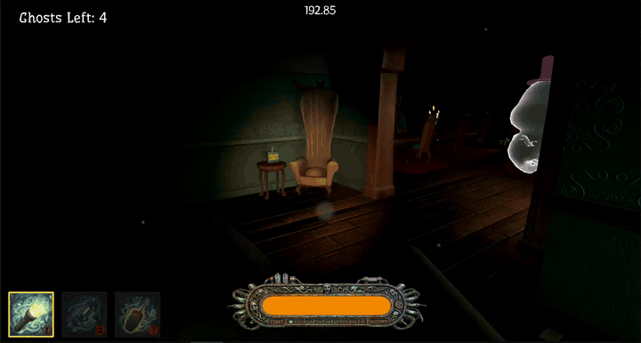
  <br>
  <i>A ghost being vacuumed to 0 HP — <code>Vacuumable.Die()</code> → <code>GhostManager.RemoveGhost()</code> → the "Ghosts Left" HUD counter ticks down by one.</i>
</p>

<p align="center">
  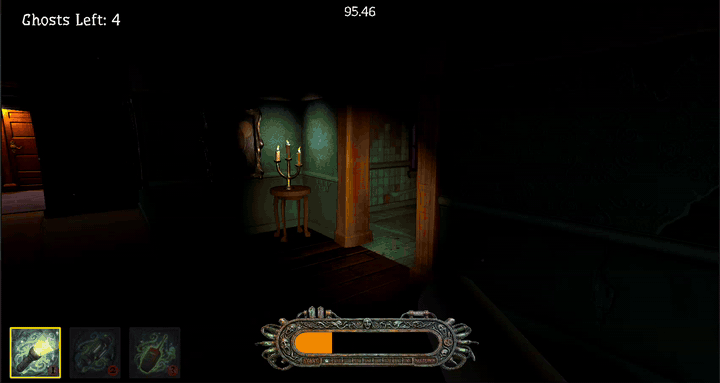
  <br>
  <i>Climactic encounter — opening the final locked door and engaging the remaining ghosts inside. The clip stops mid-fight; in a successful run, when the last counter hits zero, <code>GhostManager</code> fires <code>GameEnding.WinGame()</code> and the win screen takes over.</i>
</p>

---

### Atmosphere, Lighting & Visuals

The environment is the John Lemon tutorial house, redesigned for a darker horror atmosphere.

**Ceilings:**
All rooms originally had open tops. Ceilings were added by duplicating each floor mesh, raising it to ceiling height, and rotating 180° on the X axis so the face normals point downward into the room. No new materials or shaders were needed — existing floor materials render correctly on both surfaces.

**Lighting:**
All in-scene light prefabs (`Light.prefab`, `Flickering_Light.prefab`, `Candlestick.prefab`) had their intensities significantly reduced. The Environment Lighting Source was switched away from the default skybox (which was acting as ambient and pouring daylight-level blue through every window opening) to a dark cool ambient color. The result is a house where most corridors are in near-total darkness, pools of candlelight are isolated and meaningful, and the player's lantern feels genuinely necessary.

<p align="center">
  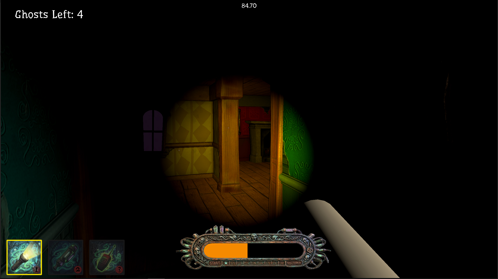
  <br>
  <i>Alternate corridor angle — most of the house sits in near-total darkness; pools of candlelight stay small and isolated.</i>
</p>

<p align="center">
  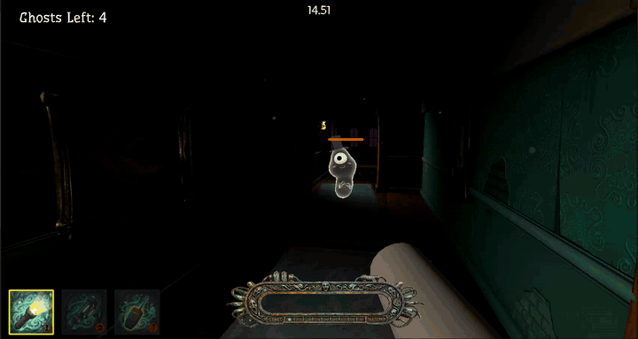
  <br>
  <i>Exploring the mansion in search of the ghosts — the lighting pass, footstep audio, and <code>PlayerNoise</code> all contribute to a stealth feel where careful movement matters. (The footstep audio is playing in-engine but cannot be heard here, since GIFs are silent — run the game to hear it.)</i>
</p>

**Fog Shaders:**
Two Shader Graph assets (`FogPlane.shadergraph`, `FogSphere.shadergraph`) produce animated scrolling fog with noise-based turbulence and an orange-yellow color. `FogPlane` uses Render Face: Front for flat ground fog around the map exterior. `FogSphere` uses Render Face: Back to render from inside a sky dome sphere — the viewer is inside the dome looking out at the fog walls.

**Dual-Camera Weapon Rendering:**
First-person tool models need a very close near clip plane (0.01f) to avoid showing geometry cutoffs right in front of the camera. The world camera, however, needs a larger near plane (0.3f) for adequate Z-buffer precision across the full scene depth. The solution is two cameras on the same rig:
- **Main Camera** renders everything except the **Weapon** layer. Near clip: **0.3f**.
- **Weapon Camera** (child of Main Camera) renders only the **Weapon** layer. Clear Flags: Depth Only. Depth: Main+1. Near clip: **0.01f**.

Lantern and vacuum models are assigned to the `Weapon` layer. The Main Camera's culling mask excludes it. The two cameras composite automatically — tools render crisply at any distance without any clipping artifact.

---

### UI System

The in-game HUD is built on Unity's **uGUI Canvas** system. Every element below is driven directly by one of the scripts we wrote — no pre-baked Inspector wiring carries the gameplay state, just runtime updates from our components.

**In-Game HUD (Canvas):**
| Element | Script | Notes |
|---------|--------|-------|
| Scared Bar BG | — | Static decorative art; custom-generated PNG |
| Scared Bar Fill | `ScaredMeter` | `Image Type: Filled, Horizontal, Left`; `fillAmount` driven per frame |
| Ghost Health Bar | `Vacuumable` | Width scaled by HP ratio |
| Ghost Counter | `GhostManager` | TMP_Text, `Eater-Regular SDF` font |
| Hotbar Frames + Icons | `ToolChanger` | Color tint changes on active selection |
| Interaction Prompt | `PlayerInteractor` | Shows/hides based on what player aims at |

---

### Audio Design

All audio in AIPhobia uses `PlayOneShot` or looped AudioSources rather than pre-baked ambience, keeping runtime memory low and giving each sound direct gameplay meaning.

| Sound | File | How It Plays |
|-------|------|-------------|
| Lantern on | `flashlight_click_on.mp3` | `PlayOneShot` on toggle |
| Lantern off | `flashlight_click_off.mp3` | `PlayOneShot` on toggle |
| Vacuum motor | `vacuum_motor.wav` | Looping AudioSource; pitch + volume scaled by `currentShakeWeight` |
| Footsteps | `footstep1.mp3` – `footstep10.mp3` | Random `PlayOneShot` from 10-variant pool; 3D spatial, fires every 0.45s while moving |

The footstep system uses ten distinct clips to avoid the "machine-gun" effect that occurs when a single looped footstep sound repeats at regular intervals. Each step randomly selects from the pool, so no two consecutive steps sound exactly alike.

---

### Player Setup

The player is built on Unity's **Starter Assets FirstPersonController**, which uses a `CharacterController` for movement, Cinemachine for the virtual camera rig, and the new Input System for input binding.

**Component Stack on the Player GameObject:**

| Component | Purpose |
|-----------|---------|
| `FirstPersonController` | WASD movement + mouse look |
| `ToolChanger` | Tool switching and HUD sync |
| `LanternTool` | Lantern toggle and audio |
| `VacuumTool` | Vacuum firing, shake, particles, audio |
| `ScaredMeter` | Fear accumulation and game-over detection |
| `PlayerInteractor` | E-press interaction SphereCast |
| `PlayerKeys` | Key inventory (HashSet) |
| `PlayerNoise` | Footstep audio + noise emission flag |

**Camera Rig:**

| Camera | Role | Near Clip |
|--------|------|-----------|
| Main Camera | World geometry + environment | 0.3f |
| Weapon Camera (child) | Tool models only (Weapon layer) | 0.01f |

The `ScaredMeter`'s `CanPlayerSeeGhost()` uses the Main Camera for both the FOV cone check and the occlusion raycast, ensuring the visibility calculation matches what the player actually sees.

---

### Technical Architecture

**Render Pipeline:** URP (Universal Render Pipeline). All custom shaders are written in Shader Graph or URP HLSL (`_BaseColor`, Render Face, etc.). No Built-In RP code.

**Navigation:** Unity AI Navigation (NavMesh). Ghost states that use NavMesh: Wander, Investigate, Chase, Hide, Hidden. FLEE disables the agent and uses direct Transform movement.

**Input:** Unity New Input System throughout. `PlayerNoise` reads `CharacterController.velocity` directly rather than polling input, so the noise system is decoupled from input binding.

**Custom Layers:**

| Layer | Purpose |
|-------|---------|
| `Walls` | All level geometry — used by vision + hearing raycasts |
| `Weapon` | Lantern and vacuum models — excluded from Main Camera, rendered only by Weapon Camera |

**Script Catalog (scripts authored for AIPhobia):**

| Script | Location | Purpose |
|--------|----------|---------|
| `GhostAI.cs` | `Assets/Scripts/` | 7-state FSM ghost brain |
| `ScaredMeter.cs` | `Assets/Scripts/` | Player fear meter |
| `EctoplasmProjectile.cs` | `Assets/Scripts/` | Parabolic arc projectile |
| `VacuumTool.cs` | `Assets/Scripts/` | Vacuum weapon |
| `Vacuumable.cs` | `Assets/Scripts/` | Universal vacuum target component |
| `GhostManager.cs` | `Assets/Scripts/` | Singleton ghost counter + win trigger |
| `LanternTool.cs` | `Assets/Scripts/` | Toggle spotlight + audio |
| `PlayerNoise.cs` | `Assets/Scripts/` | Footstep audio + noise emission |
| `PlayerInteractor.cs` | `Assets/Scripts/` | E-press SphereCast interaction |
| `PlayerKeys.cs` | `Assets/Scripts/` | HashSet key inventory |
| `InteractableDoor.cs` | `Assets/Scripts/` | IInteractable door — key check + destroy |
| `IInteractable.cs` | `Assets/Scripts/` | Interface: GetPrompt + Interact |
| `ToolChanger.cs` | `Assets/Package/` | Tool switching + HUD sync |
| `ToolSwitcher.cs` | `Assets/Scripts/` | Early tool switcher (reference) |
| `VacuumableSetup.cs` | `Assets/Editor/` | Editor batch-add/remove Vacuumable |

---

## And Here Is a Complete Gameplay of AIPhobia

Every feature, every state of the FSM, every system documented above — chained together into a single end-to-end run. From the first lit corridor through every locked door, every ectoplasm dodge, every vacuum suction, all the way to the final ghost vacuumed and the win screen.

**▶ Watch the full playthrough:** [`visuals/complete_gameplay_compressed.mp4`](visuals/complete_gameplay_compressed.mp4) *(45 MB, 4:18)*

> Click the link to play or download the full run. It is included as a video rather than a GIF because a 4-minute GIF would balloon to several hundred megabytes — the per-feature GIFs above already animate every individual system this run demonstrates.

---

*AIPhobia — AI in Gaming, Second Semester*
